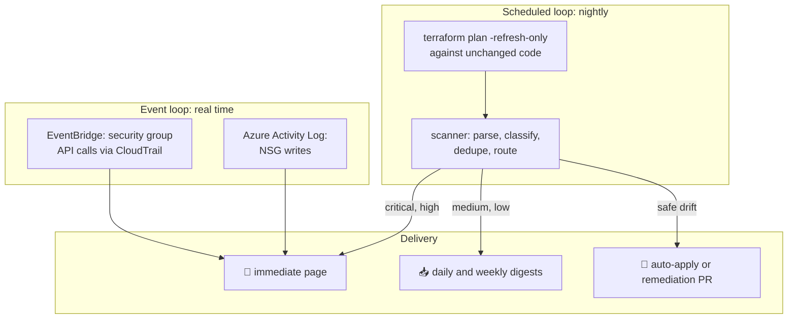

<div align="center">

# 🛡️ DriftGuard

### Catch what changed before it becomes an incident.

Multi-cloud drift detection, actionable alerting, and safe auto-remediation for Terraform estates on AWS and Azure.

[](https://github.com/TyroneMadison/driftguard/actions/workflows/ci.yml)
[](https://github.com/TyroneMadison/driftguard/actions/workflows/drift-scan.yml)


</div>

---

## 💡 The problem this solves

In any platform serving many environments across AWS, Azure, and on-prem, infrastructure changes happen outside the pipeline: a console hotfix during an incident, a script with too many permissions, a well-meaning admin. Each one plants a landmine:

- 🧨 The next `terraform apply` silently reverts an undocumented fix
- 🚪 A widened security group rule sits unnoticed until an auditor or an attacker finds it
- 💸 Orphaned resources accumulate and quietly inflate the bill
- 📟 And the usual answer, alert on everything, trains everyone to mute the channel

**DriftGuard treats drift as an operations discipline:** detect on two loops, classify by reviewable policy, deduplicate, route by severity, and attach the remediation decision to every finding. Quiet is a feature.

## 🗺️ How it works



**The slow loop** runs `terraform plan -refresh-only` nightly against unchanged code. Any planned change is drift by definition. **The fast loop** never waits for the schedule: security group and NSG modifications outside pipelines raise events in near real time via EventBridge and Azure Activity Log alerts, both provisioned as code in this repo.

## 🚨 Alerting that people act on instead of mute

| Severity | Example | Channel | Remediation |
| --- | --- | --- | --- |
| 🔴 critical | SG/NSG rules, IAM, RBAC | immediate page | human investigates first, always |
| 🟠 high | database and storage config | immediate message | open PR: adopt or enforce |
| 🟡 medium | app settings, replacements | daily digest | open PR: adopt or enforce |
| 🟢 low | tag-only drift | weekly digest | auto-apply from code |

Three rules keep the signal trustworthy:

1. **Severity is reviewable policy**, not code. `policies/severity-rules.yaml` is the audit trail for every paging decision, and changing it takes a PR.
2. **Deduplication with a 24 hour window.** Known drift becomes a digest line, never a repeat page.
3. **Every alert carries its next action.** The two honest resolutions are named: *enforce* (reality moved, code is right) or *adopt* (reality is right, codify it through review). Critical drift never self-heals silently, because an unexplained security rule change might be an attack, not an accident.

## 🚀 Quickstart

```bash
pip install -r requirements.txt

make test         # 16 pytest cases across parser, policy, routing, remediation
make scan-demo    # full pipeline against recorded drift, no cloud needed
```

Sample output from `make scan-demo`:

```text
[immediate] 1 item(s)
  CRITICAL aws_security_group.app (demo) update: ingress
           note: Security group changed outside the pipeline. Treat as possible incident.
[daily-digest] 2 item(s)
  MEDIUM   aws_ssm_parameter.feature_flag (demo) missing: <resource missing in cloud>
  MEDIUM   aws_instance.legacy_worker (demo) replace: ami
[weekly-digest] 1 item(s)
  LOW      azurerm_storage_account.logs (demo) update: tags
           note: Tag-only drift, safe to enforce from code.

remediation plan -> auto-apply: 1, open-pr: 2, page-human: 1
```

Exit codes are CI-native: `0` clean, `1` drift found, `2` critical drift.

## ☁️ One design, two clouds

| Concern | AWS | Azure |
| --- | --- | --- |
| Alert delivery | SNS topic + optional email | Monitor Action Group |
| Threshold alarm | CloudWatch alarm on `DriftGuard/CriticalDrift` | Metric alert on storage availability |
| Spike detection | CloudWatch **anomaly detection band** on drift volume | same pattern via Monitor |
| Real-time tripwire | EventBridge rule on SG API calls (CloudTrail) | Activity Log alert on NSG writes |
| Monitored demo stack | S3 + SSM parameter | Storage account |

Flip a tag or add a rule in the console, and the next scan reports it, classified and routed.

## 💸 The cost drift bonus

`powershell/Find-OrphanedResources.ps1` sweeps a subscription for the classic silent spenders: unattached managed disks, orphaned NICs, and unassociated public IPs. It estimates monthly waste and supports gated cleanup with `-RemoveOrphans -WhatIf`. Drift is not only configuration, it is also money.

## 🤖 Built AI-first, verified deterministically

Detection logic, tests, and docs are drafted with AI pair engineering and gated by deterministic checks: pytest, an end-to-end demo scan in CI, and `terraform validate` on both cloud stacks. `CLAUDE.md` encodes the contract AI agents follow in this repo, including the one rule that never softens: **critical drift always pages a human.**

## 📁 Repository map

```text
guard/               Scanner: plan parser, severity, alert router, remediator, CLI
policies/            severity-rules.yaml, the reviewable paging policy
sample_data/         Recorded terraform plan JSON (clean and drifted)
tests/               16 pytest cases
terraform/aws/       SNS, CloudWatch alarms + anomaly band, EventBridge tripwire, demo stack
terraform/azure/     Action group, metric alert, Activity Log NSG tripwire, demo stack
powershell/          Orphaned resource sweeper with cost estimates
docs/                Architecture and the alerting philosophy
runbooks/            Drift triage: what to do when the page arrives
.github/workflows/   ci (tests + validate) and drift-scan (nightly schedule)
```

## 🧭 Roadmap

- [ ] Slack and Teams webhook delivery straight from the scheduled workflow
- [ ] Auto-generated remediation PRs with the plan diff attached
- [ ] Coverage reporting: percent of stacks scanned nightly
- [ ] Companion project integration: drift checks for **Tenant Migration Factory** tenant registries

## 📜 License

MIT. Built by **Tyrone Madison** as a working blueprint for keeping regulated, multi-cloud Terraform estates honest between deployments.
