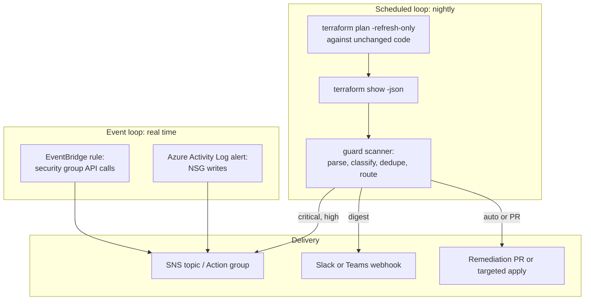

# Architecture

## Two detection loops

DriftGuard runs a slow loop and a fast loop, because drift has two
different failure modes.

* The scheduled loop catches everything, with full context, once a day.
* The event loop catches the scary class (network exposure changes) in
  near real time, straight from CloudTrail via EventBridge on AWS and
  the Activity Log on Azure.

## Severity as reviewable policy

policies/severity-rules.yaml maps resource patterns to severity and
remediation eligibility. The file is the audit trail for every paging
decision the system makes. First match wins, unmatched resources default
to medium, and tag-only changes are downgraded to low and marked safe to
enforce automatically.

## Publishing health metrics

Real deployments publish two custom metrics after every scan: DriftCount
and CriticalDrift. The Terraform stacks provision a threshold alarm on
CriticalDrift and an anomaly detection band on DriftCount, so a sudden
spike in total drift (an unreviewed change wave, a misfiring automation
account) raises attention even when no single finding is critical.
